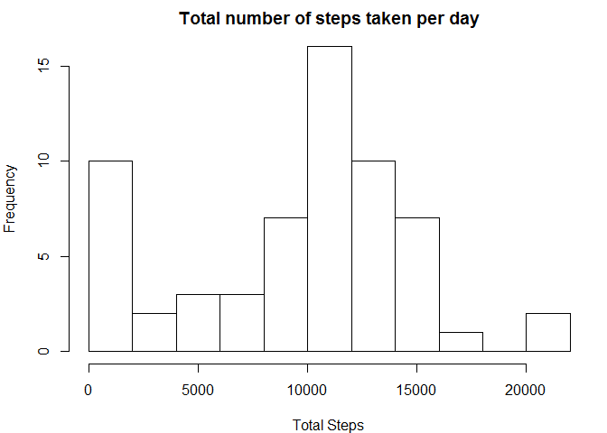
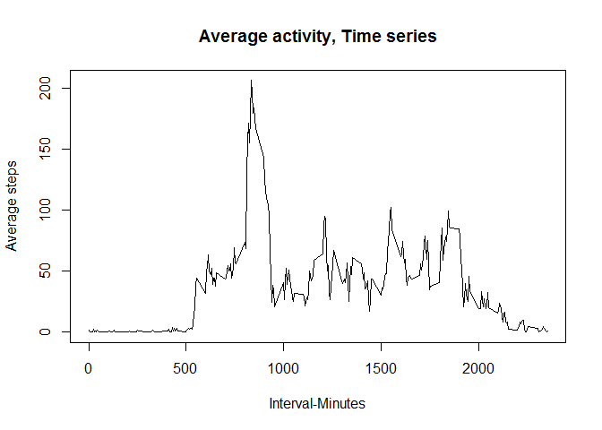
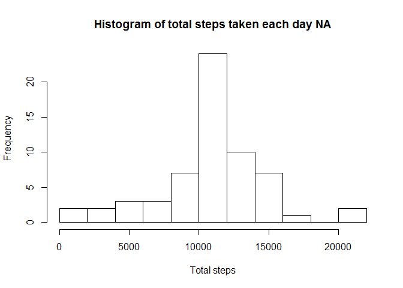

# Reproducible Research: Peer Assessment 1
Ajay Jain  
February 21, 2017  

## Introduction
It is now possible to collect a large amount of data about personal movement
using activity monitoring devices such as a Fitbit, Nike Fuelband, or Jawbone
Up. These type of devices are part of the "quantified self" movement - a group
of enthusiasts who take measurements about themselves regularly to improve
their health, to find patterns in their behavior, or because they are tech geeks.
But these data remain under-utilized both because the raw data are hard to
obtain and there is a lack of statistical methods and software for processing and
interpreting the data.

This assignment makes use of data from a personal activity monitoring device.
This device collects data at 5 minute intervals through out the day. The data
consists of two months of data from an anonymous individual collected during
the months of October and November, 2012 and include the number of steps
taken in 5 minute intervals each day
## Loading and preprocessing the data

The [repository]("https://github.com/rdpeng/RepData_PeerAssessment1") is provided with the assignment template and activity data in zip. This reposotory is cloned in my local machine.The activity file is processed through activity.R file.The r package is set to directory path:   

```r
#setwd("C:/Users/Ajay_jain/coursework/mod5_1"). 
#opts_chunk$set(echo=TRUE,results="asis")
data<-read.csv("activity.csv",stringsAsFactors = FALSE,header=TRUE)
library(plyr)
library(lattice)
```

### Data
The data for this assignment can be downloaded from the course web site:
. Dataset: Activity monitoring data [52K]
The variables included in this dataset are:
. steps: Number of steps taking in a 5-minute interval (missing values are
coded as NA)
. date: The date on which the measurement was taken in YYYY-MM-DD
format
. interval: Identifier for the 5-minute interval in which measurement was
taken
The dataset is stored in a comma-separated-value (CSV) file and there are a
total of 17,568 observations in this dataset.

## What is mean total number of steps taken per day?

Here I put the total number of steps being taken using function ddply.the data is stored is Tot_steps by date.

```r
Tot_steps <-ddply(data,.(date),summarise,totalsteps=sum(steps,na.rm=TRUE))
sum(Tot_steps$totalsteps)
```

```
## [1] 570608
```
  The histogram for the steps is

```r
par(mar=c(4,4,2,1))
hist(Tot_steps$totalsteps,breaks=10,xlab="Total Steps", main="Total number of steps taken per day")
```

<!-- -->

## What is the average daily activity pattern?

The average steps are

```r
mean(Tot_steps$totalsteps,na.rm=TRUE)
```

```
## [1] 9354.23
```
The median of steps is

```r
median(Tot_steps$totalsteps,na.rm=TRUE)
```

```
## [1] 10395
```
### average daily activity pattern
the average daily pattern is computed as

```r
Tot_steps2<-ddply(data,.(interval),summarise,meansteps=mean(steps,na.rm=TRUE))
mean(Tot_steps2$meansteps)
```

```
## [1] 37.3826
```
Plot for the average daily activity pattern

```r
plot(Tot_steps2,type="l",main="Average activity, Time series",xlab="Interval-Minutes", ylab="Average steps")
```

<!-- -->
### most steps


```r
Tot_steps2[which.max(Tot_steps2$meansteps),]
```

```
##     interval meansteps
## 104      835  206.1698
```
## Imputing missing values

The missing values in the data is

```r
sum(is.na(data))
```

```
## [1] 2304
```
Let's group data on total steps. We will first calculate the average of 5 Min interval. this value will then be used toi calculate the NA.


```r
data1<-merge(data,Tot_steps2, by ="interval", sort=TRUE)
mark<-is.na(data1$steps)
data1$steps[mark]<-data1$meansteps[mark]
Tot1_steps<-ddply(data1, .(date),summarise,totalsteps=sum(steps,na.rm=TRUE))
```
Histogram of steps

```r
hist(Tot1_steps$totalsteps,breaks=10,main="Histogram of total steps taken each day NA",xlab="Total steps")
```

<!-- -->
## Are there differences in activity patterns between weekdays and weekends?
Converting dates into weekdays and weekends

```r
#Tot_steps3<-transform(data,date=strptime(date,format="%Y-%m-%d"))
#day1<-factor(weekdays(Tot_steps3$date) %in% c("Saturday", "Sunday"),level=c(TRUE,FALSE),labels = c("weekend",weekday))
```
plot for the activity pattern

```r
#xyplot(meansteps ~ interval|day1),data=Tot_steps3,ylab="Average Steps",type= "l",main= "comparision of average steps between weekday and weekend")
```
